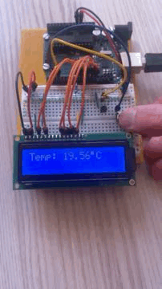
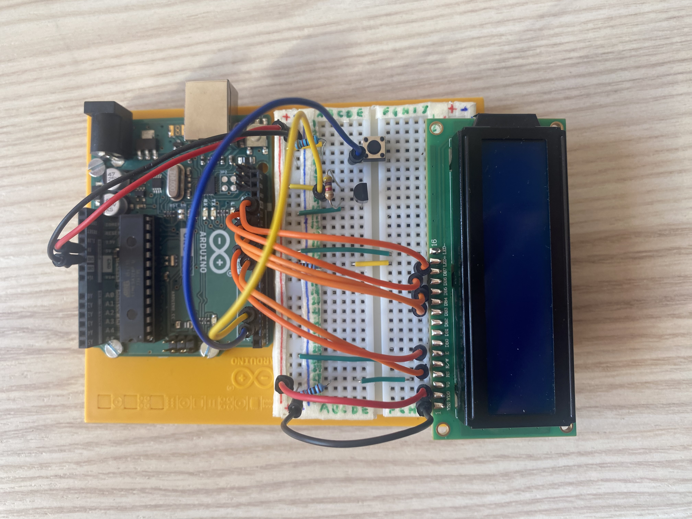
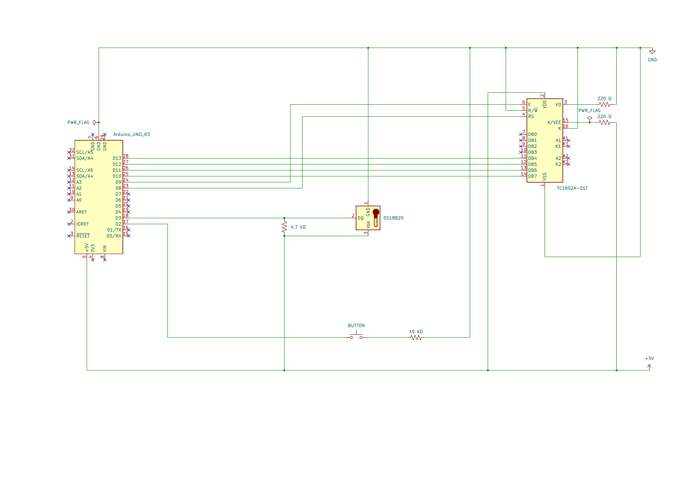
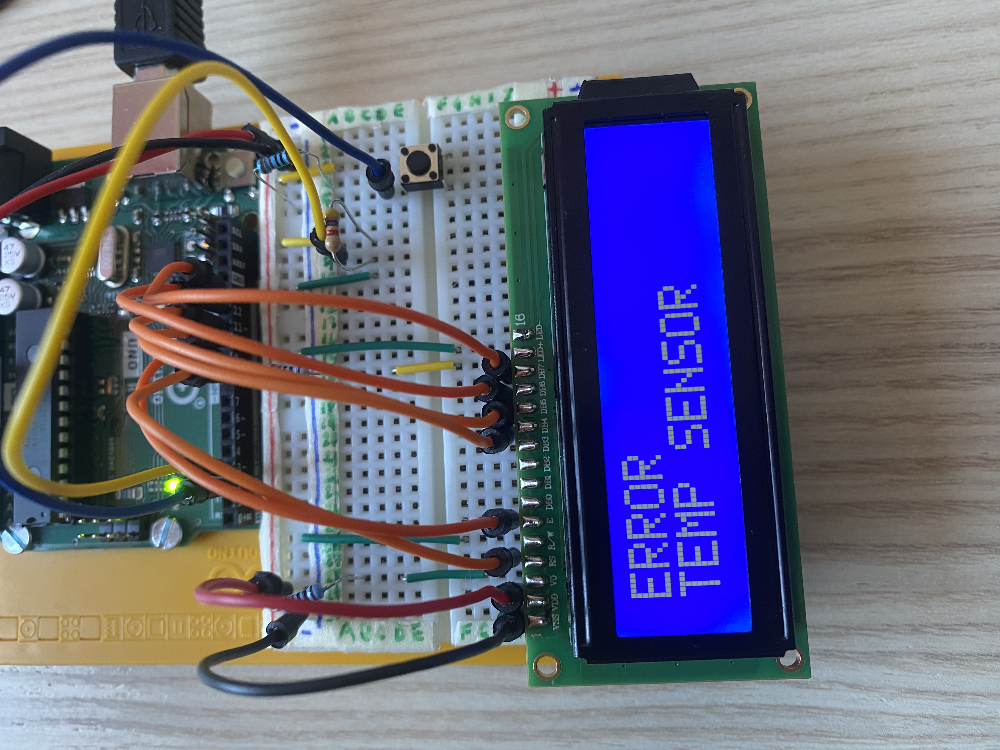

# Temperature LCD - Bare-Metal AVR

A bare-metal C project for the ATmega328P. Custom 1-Wire and LCD drivers, no external libraries.

## Overview

This project implements a real-time temperature monitoring system on an ATmega328P microcontroller. The DS18B20 sensor communicates 
via a custom 1-Wire driver written from scratch, and the measured temperature is displayed on a TC1602A-01T LCD through a 
4-bit driver. A button switches between Celsius, Fahrenheit and Kelvin. No external application libraries. All drivers implemented 
from scratch via direct register manipulation, using only the avr-gcc toolchain.



For the video demo, see the `media/` folder.

## Hardware

The system is built around an Arduino Uno R3 (ATmega328P) connected to a DS18B20 temperature sensor and a 
TC1602A-01T 16x2 LCD display. The circuit is currently assembled on a breadboard.



### Components

| **Component**       | **Quantity** | **Notes**                        |
| :------------------ | :----------- | :------------------------------- |
| Arduino UNO R3      | 1            | ATmega328P @ 16MHz               |
| DS18B20             | 1            | 1-Wire temperature sensor        |
| TC1602A-01T         | 1            | 16x2 LCD, 4-bit mode             |
| Switch Button       | 1            |                                  |
| 10 kΩ Resistor      | 1            | Button pull-down                 |
| 4.7 kΩ Resistor     | 1            | 1-Wire bus pull-up               |
| 220 Ω Resistor      | 2            | LCD contrast and backlight       |
| Jumper Wires        | 17           |                                  |
| Breadboard          | 1            | 380 tie points                   |

### Schematic
The KiCad project file and a PDF version are available in the `hardware/` folder.



## Software
The firmware is organized into independent, single-responsibility modules. Each peripheral has a dedicated driver 
with a clean public interface, keeping hardware-specific code separate from application logic.

### Structure

| **File**                   | **Description**                                                           |
| :------------------------- | :------------------------------------------------------------------------ |
| src/main.c                 | System setup, GPIO/timer/interrupt configuration, main loop               |
| src/temp_sensor.c          | DS18B20 1-Wire driver: reset, bit/byte read-write, temperature conversion |
| src/lcd.c                  | TC1602A-01T 4-bit driver: initialization, cursor control, print           |
| src/button.c               | INT0 ISR with 200ms debounce, FSM state cycling                           |
| src/mcu_timer.c            | Timer0 CTC ISR, atomic 32-bit millisecond counter                         |
| include/temp_sensor.h      | DS18B20 command definitions and public driver interface                   |
| include/lcd.h              | LCD command definitions, special characters, public driver interface      |
| include/button.h           | INT0 ISR declaration, unit_measure extern                                 |
| include/mcu_timer.h        | system_millis extern, get_millis() declaration                            |
| include/fsm_states.h       | DisplayState enum: CELSIUS, FAHRENHEIT, KELVIN, SENSOR_ERROR              |
| include/pin_definitions.h  | ATmega328P pin mapping for all peripherals                                |

### Protocols
The following section describes the two communication protocols implemented in this project and the key implementation decisions.

#### 1-Wire (DS18B20)
* **Reset and Presence Pulse:** Every communication starts with a 480us pulse, during which the master pulls the bus LOW. After the 
release, the master samples at 70us, instead of the 60us mentioned in the datasheet, in order to cover both slow and faster sensors 
during their guaranteed presence pulse window (60-240us).

* **Write and Read slot:** In Write 1 slot the master pulls the bus LOW and then releases it within 15us. The bus is pulled HIGH by 
the resistor for the remainder of the slot. Holding for 10us ensures the sensor detects the start but samples a HIGH state. In Write 0
the master pulls the bus LOW and holds it for the duration of the slot (minimum 60us). Holding for 55-60us ensures the sensor 
samples a LOW state during its 15-60us window. For Read slots, the master initiates with a 2us LOW pulse, then releases 
the bus and samples at 12us total, within the 15us datasheet limit, with a safety margin.

* **Asynchronous Conversion:** The DS18B20 sensor takes up to 750ms for a 12-bit conversion. Instead of blocking the system with a 
`_delay_ms(750)`, the function `get_raw_temperature()` uses a two-state FSM and the Timer0's millisecond counter to check the 
elapsed time without occupying the CPU. 

#### 4-bit (TC1602A-01T)
* **Initialization Sequence:** Wake up sequence requires three 0x03 nibbles with specific delays (> 4.1ms, > 100us) before switching 
to 4-bit mode. This is a fundamental requirement of the TC1602A-01T datasheet; without this sequence the peripheral would not 
correctly respond to the commands.

* **4-bit Transfer:** Each byte is divided into two 4-bit nibbles. High nibble (DB7-DB4) is sent first, then the low nibble (DB3-DB0).
The 4 bits get aligned to physical pins (PB2-PB5) with a left-shift of two positions before writing on PORTB.

* **Enable Pulse and Data Latch:** TC1602A-01T controller samples data on Enable signal's falling edge. HIGH pulse lasts for 1us,
higher than the 150ns in the datasheet, in order to guarantee compatibility with the slower units. After every nibble we wait for 
50us to let the controller process the data.

### Critical Sections
* **Atomic 32-bit read:** AVR is an 8-bit architecture while `system_millis` is a `uint32_t` and uses 32 bits, so the reading 
requires 4 CPU cycles. If the ISR updates `system_millis` during the reading, the data could be corrupted. `cli()` disables
every interrupt to protect the full 32-bit reading (4 CPU cycles), `sei()` re-enables the interrupts at the end of the reading 
operation.

* **1-Wire Timing Protection:** Protocol timing is critical and in the order of microseconds, an interrupt during the bit sequence 
would corrupt the communication. `cli()` disables every interrupt to protect the 1-Wire bit operations (`sensor_reset()`, 
`sensor_write_bit()`, `sensor_read_bit()`), `sei()` re-enables the interrupts at the end of the operation.

## Problems and resolutions
This section documents the key design decisions and problems encountered during development, along with their solutions.

### Blocking Delay During Temperature Conversion
Initially I used `_delay_ms(750)` to wait for DS18B20 conversion, but the system blocked for 750ms each cycle and the button did
not respond during this block. As a solution I implemented a two-state FSM in `get_raw_temperature()` using `get_millis()` to check 
the elapsed time without blocking the main loop, ensuring a responsive system.

### Sensor Error Handling
The original system had no way to detect a sensor's disconnection or malfunction, but it continued to show the last valid value 
without any error warning. As a solution I added the `sensor_reset()` return control, the sentinel value `TEMP_SENSOR_ERROR` 
(`INT16_MIN`), and the state `SENSOR_ERROR` in the FSM, which shows a warning message on the display. When the sensor gets 
re-inserted (or when it gets replaced with a new one, in case of malfunction), the system refreshes and restores the `CELSIUS` state.



### Microsecond Delays
I intentionally kept all the microsecond delays, and the millisecond delay in `lcd_initialization()`; the reason is that the 
microsecond delays are imperceptible and the millisecond ones in the initialization do not influence the performances because it 
happens only during the system's starting. Adding asynchronous handling for these cases would have increased the complexity
without any perceptible benefit. The main goal was the fluidity during a normal use, especially the button's immediate response.

### LCD Character Overflow
`lcd_print()` does not check the string's length before printing on the display. A possible overflow would write on the DDRAM
beyond the last visible character (16<sup>th</sup>), but the TC1602A-01T has 40 DDRAM cells per row with separate addresses for row 0 
and row 1, so an overflow does not compromise the adjacent row. The final spaces added to the strings overwrite possible residual 
characters from previous prints, avoiding visual artifacts without the use of `lcd_send_byte(LCD_CLEAR_DISPLAY, LCD_COMMAND)` at every
iteration.

## Installation and usage
The following instructions are tested on Linux. See the Makefile comments for macOS and Windows adjustments.

### Prerequisites
The following tools are required: `avr-gcc` and `avrdude`.

On Debian-based systems:
```bash
sudo apt install gcc-avr avrdude
```

### Clone and build
```bash
git clone https://github.com/steve-caiula/Temperature-LCD.git
cd Temperature-LCD
make
```

To remove build artifacts:
```bash
make clean
```

### Flash
Verify that the `PORT` variable in the Makefile matches your system before flashing. Then run:
```bash
make flash
```

### Usage
At startup, the display shows the temperature in Celsius. The button cycles through Celsius, Fahrenheit and Kelvin. 
If the sensor is disconnected or malfunctions, the display shows "ERROR / TEMP SENSOR". The system automatically 
restores the Celsius state when the sensor is reconnected.

## References

* [ATmega328P](https://ww1.microchip.com/downloads/en/DeviceDoc/Atmel-7810-Automotive-Microcontrollers-ATmega328P_Datasheet.pdf)
* [DS18B20](https://www.analog.com/media/en/technical-documentation/data-sheets/DS18B20.pdf)
* [TC1602A-01T](https://www.digikey.in/htmldatasheets/production/2410219/0/0/1/TC1602A-01T.pdf)
* [Arduino Uno R3 Pinout](https://docs.arduino.cc/resources/pinouts/A000066-full-pinout.pdf?_gl=1*1tx972h*_up*MQ..*_ga*MTM0OTgzMjYyMS4xNzcyMDM4NTUx*_ga_NEXN8H46L5*czE3NzIwMzg1NDgkbzEkZzAkdDE3NzIwMzg1NDgkajYwJGwwJGgxNTk2NTgzNzcx)

## Author

Stefano Caiula 
* [GitHub](https://github.com/steve-caiula)
* [LinkedIn](https://www.linkedin.com/in/stefano-c-a76137258/)